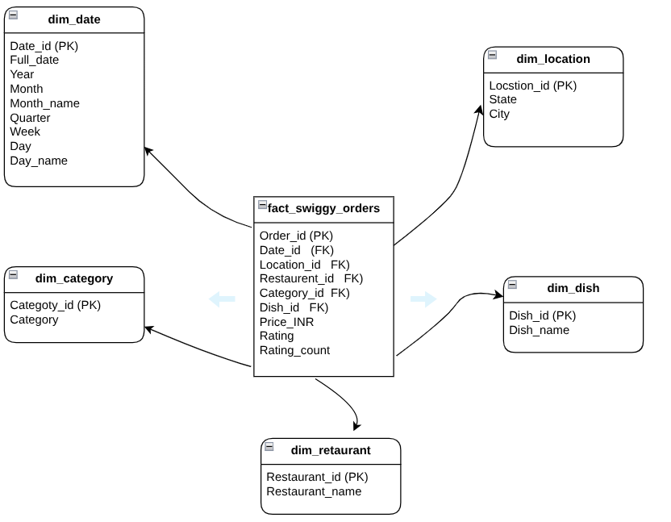

# 💹 Swiggy Sales 2025 Analysis (SQL)

## 📌 Project Overview

The project analyzes Swiggy sales data from 2025 to understand restaurants performance across different locations and time periods, The analysis focuses on top-performing dishes, customer ordering ppatterns , and overall customer satisfation based on ratings.

An End-to-end workflow was  implemented , SQL  was used to clean dataset by handling null values, blank fields, and duplicates, A star schema data model was then created to improve analytical efficiency and support structured querying.

The project further explores key business insights such as sales distribution, customer spending behavior, dish popularity and rating patterns.

## 🗂️ Dataset

**About**
Swiggy is an Indian online food delivery and quick-commerce platform that connects customers with restaurants through a mobile application or website. The dataset represents food orders placed across multiple cities in India.

**Time Period**
2025

**Dataset Size**
197,522 rows

**Columns**

* State
* City
* Order Date
* Restaurant
* Location
* Category
* Dish
* Price
* Rating
* Rating Count

## 🔧 Project Workflow

| Step | Script | Purpose |
|-----|-----|-----|
| 1 | `01_data_cleaning.sql` | Data cleaning: handle nulls, blanks, duplicates |
| 2 | `02_schema.sql` | Create star schema (1 fact + 5 dimensions) |
| 3 | `03_insert_dimensions.sql` | Load dimension tables |
| 4 | `04_indexes.sql` | Create indexes to improve performance |
| 5 | `05_insert_fact.sql` | Load fact table |
| 6 | `06_analysis.sql` | Analytical queries for business insights |

## ⭐ Schema Design



## 💡 Key Questions Explored

* What is the total number of orders?
* What is the total revenue ?
* What is the average dish price?
* Which time periods show peak ordering activity?
* Which cities and states generate the most orders?
* Which restaurants perform the best in terms of orders?
* Which dishes receive the highest customer ratings?
* What are the customer spending patterns across price ranges?

## 📊 Key Findings

* **Total Orders:** 197,401 orders were recorded in the dataset.

* **Total Revenue:** ₹53.0 million (INR) generated from all orders.

* **Average Dish Price:** ₹268.50 INR.

* **Overall Average Rating:** 4.3 ⭐ across all dishes.

* **Peak Ordering Period:** June and August recorded the highest order volumes, while order distribution across days of the week remained relatively consistent.

* **Top City:** Bengaluru generated the highest number of orders.

* **Top State:** Karnataka produced the highest revenue, totaling approximately ₹5.3 million INR.

* **Top Restaurants:** McDonald's and KFC recorded the highest order volumes.

* **Most Popular Dishes:** `Veg Fried Rice` and `Choco Lava Cake` were the most frequently ordered dishes.

* **Most Popular Category:** The **Recommended** menu category had the highest number of orders.

* **Highest Rated Price Range:** Premium dishes priced above ₹500 achieved the highest average rating (4.38+).

* **Customer Spending Behavior:** Most orders fall within the ₹100–₹400 price range, indicating that customers tend to prefer moderately priced dishes rather than expensive options.


## 🗃️ Project Structure

    swiggy-analysis/
    │
    ├── README.md
    ├── data/
    │   └── swiggy_dataset.csv
    │
    ├── 01_data_cleaning.sql
    ├── 02_schema.sql
    ├── 03_insert_dimensions.sql
    ├── 04_indexes.sql
    ├── 05_insert_fact.sql
    ├── 06_analysis.sql
    │
    ├── Queries_results.pdf
    └── schema/
        └── schema_star.png

## ▶️ How to Run
1. Clone the repository
```bash
   git clone https://github.com/abdelhakmorhlia01-hub/swiggy-sales-analysis.git
```
2. Import dataset into MySQL
3. Execute SQL files **in order** (01 → 06)
4. Use any MySQL client (phpMyAdmin, MySQL Workbench, DBeaver)

## 🙋 Author
**Abdel**  
[LinkedIn](https://www.linkedin.com/in/abdelhak-morhlia-41366a396/) • [GitHub](https://github.com/abdelhakmorhlia01-hub)

--

If you found this project useful, feel free to ⭐ star the repository!Compartir